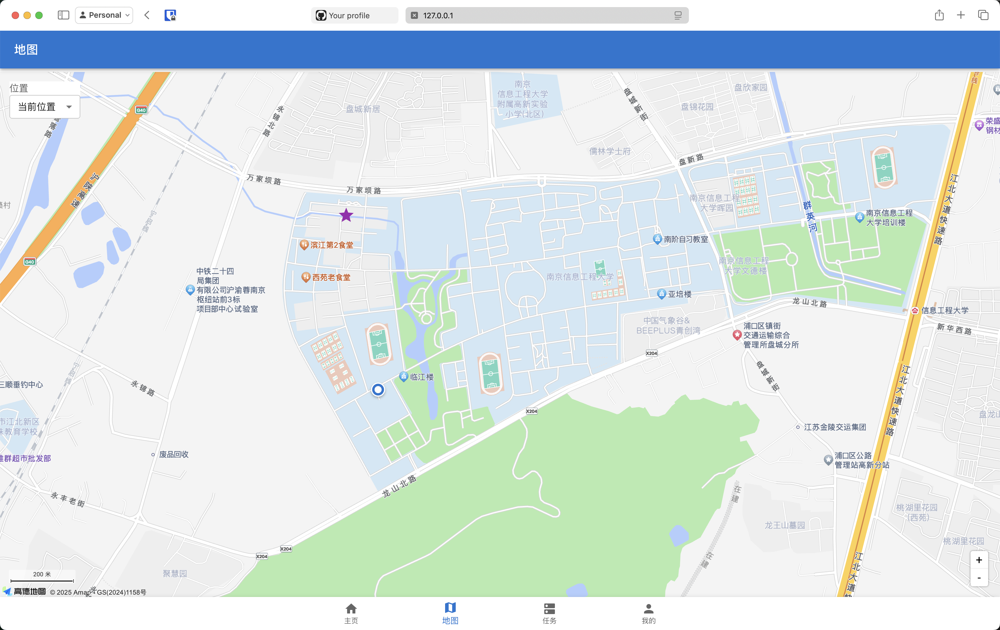

# 7ma-web

`7ma-web` 是一个为 "7ma" 共享单车/电单车服务设计的现代化 Web 前端应用。它提供了比官方应用更丰富、更强大的功能，旨在提升用户体验，特别是对于高级用户。

本项目通过调用非官方的后端 API 实现，提供车辆查找、预约、任务管理、地图可视化等一系列便捷操作。

## ✨ 主要功能

- **多模式登录**：支持通过手机验证码或长期有效的 `Token` 进行登录。
- **强大的车辆查找**：
    - 快速查找附近车辆。
    - 通过车辆编号或扫描二维码精确查找。
    - 管理“常用地点”，一键查找公司或家附近的可用车辆。
- **地图总览**：
    - 在高德地图上直观地查看所有附近车辆、常用地点和您的当前位置。
    - 点击车辆图标即可获取详细信息。
- **自动化任务系统**：
    - **后台任务**：实时跟踪正在执行的后台操作，例如“保留车位”任务。
    - **周期任务**：创建自定义的自动化任务，例如“每天早上8点，在公司附近找一辆电量高于80%的电单车并自动预约”。
- **个人中心**：
    - 查看账户余额、处理未支付订单。
    - 方便地导入和导出 `Token`，轻松在多设备间同步登录状态。
- **骑行状态面板**：
    - 在预约或骑行时，顶部会显示一个信息面板，包含骑行时长、预估费用、车辆电量等。
    - 提供“临时锁车”、“开锁”、“还车”等快捷操作。

## 📸 应用截图


**主页界面**


**地图界面**



**任务管理界面**


**个人中心**


## 🚀 快速开始

1.  **安装依赖**

    首先，请确保您已经安装了 `Python` 环境和 `pip`。然后通过以下命令安装项目所需的依赖：

    ```bash
    pip install -r requirements.txt
    ```

2.  **运行应用**

    使用 `uvicorn` 来启动 Web 服务器：

    ```bash
    uvicorn app.main:app --reload --host 0.0.0.0 --port 8000
    ```

    启动后，您可以通过浏览器访问 `http://localhost:8000` 来使用本应用。

## 🛠️ 技术栈

- **前端**:
    - [React](https://reactjs.org/)
    - [Material-UI (MUI)](https://mui.com/)
    - [AMap JS API (高德地图)](https://lbs.amap.com/api/javascript-api/summary)
- **后端**:
    - [Python](https://www.python.org/)
    - [FastAPI](https://fastapi.tiangolo.com/)
    - [Uvicorn](https://www.uvicorn.org/)
    - [httpx](https://www.python-httpx.org/)
    - [APScheduler](https://apscheduler.readthedocs.io/en/latest/)